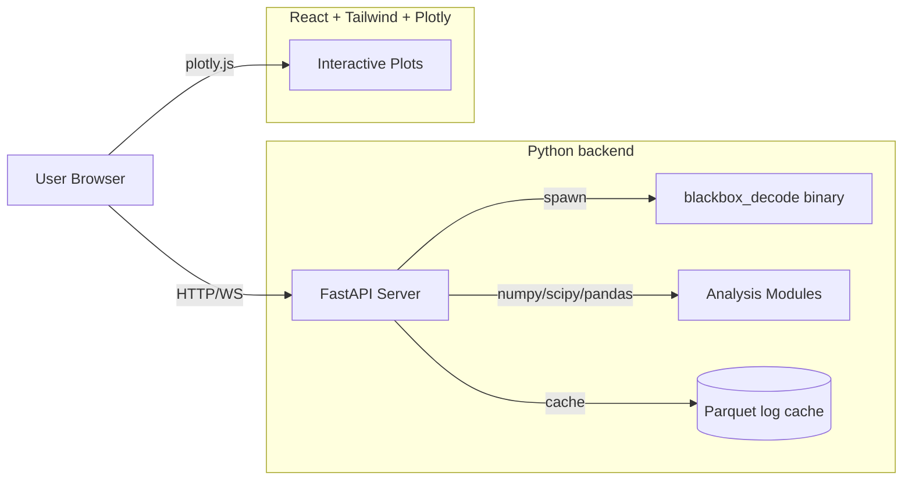

# PIDToolBox React Clone

## Goal

Achieve full feature parity with PIDscope ([Refs/PIDscope/PIDscope.m](Refs/PIDscope/PIDscope.m)) — all 8 firmware parsers and all analysis tools — using a Python math backend and a modern React UI. Delivered in phases so each phase produces a working, testable product.

## Architecture



- **Backend:** Python 3.11+, FastAPI, uvicorn, numpy, scipy, pandas, pyarrow. Sessions hold parsed log data in memory + Parquet cache on disk so re-running tools is fast.
- **Frontend:** Vite + React 18 + TypeScript + TailwindCSS + Zustand (state) + react-plotly.js + react-router. shadcn/ui for controls.
- **Transport:** REST for actions, WebSocket for long-running compute progress (e.g. spectrogram for 200s log).
- **Parser strategy:** Wrap `blackbox_decode` via subprocess in phase 1 (matches [PSquicJson2csv.m](Refs/PIDscope/src/core/PSquicJson2csv.m) approach). Leave a `LogParser` interface so a pure-Python parser can replace it later without touching analysis code.
- **Packaging:** Dev = `uvicorn` + `vite dev` with proxy. Prod = single Docker image, plus optional Tauri wrapper later for an offline desktop build.

## Repository layout

```
PIDToolBox/
  backend/
    pidbox/
      core/         # parsers, signal processing (mirrors src/core)
        parsers/    # betaflight.py, emuflight.py, ardupilot.py, ...
        spectral.py        # PSSpec2d + PSthrSpec
        stepresponse.py    # PSstepcalc
        filters.py         # PSbfFilters (pt1/pt2/pt3/biquad/notch)
        chirp.py           # PSestimateFreqResponse + chirp window
        rpm.py             # PSestimateRPM
      api/          # FastAPI routers
      session.py    # in-memory session + Parquet cache
    tests/          # pytest, golden-data tests vs Octave outputs
    pyproject.toml
  frontend/
    src/
      pages/        # LogViewer, SpectralAnalyzer, StepResponse, FreqTime, FreqThrottle, FilterSim, SetupInfo, Stats
      components/   # FileDropzone, AxisSelector (R/P/Y), TraceToggle, ColormapPicker, ...
      lib/api.ts    # typed client
      store/        # Zustand session store
    package.json
    tailwind.config.ts
  Refs/             # existing reference material (read-only)
  docker/
```

## Mapping: PIDscope module → Python module

- [PSgetcsv.m](Refs/PIDscope/src/core/PSgetcsv.m), [PSimport.m](Refs/PIDscope/src/core/PSimport.m), [PSload.m](Refs/PIDscope/src/core/PSload.m), [PSquicJson2csv.m](Refs/PIDscope/src/core/PSquicJson2csv.m) → `core/parsers/*.py` + `core/loader.py`
- [PSSpec2d.m](Refs/PIDscope/src/core/PSSpec2d.m), [PSthrSpec.m](Refs/PIDscope/src/core/PSthrSpec.m), [PStimeFreqCalc.m](Refs/PIDscope/src/core/PStimeFreqCalc.m) → `core/spectral.py` (use `scipy.signal.welch`/`stft` where equivalent, keep manual Hann+FFT where the original deviates from `pwelch` for backward-compatible results)
- [PSstepcalc.m](Refs/PIDscope/src/core/PSstepcalc.m), [PSstepFromFRD.m](Refs/PIDscope/src/core/PSstepFromFRD.m) → `core/stepresponse.py` (Wiener deconvolution `G·conj(H) / (H·conj(H)+ε)`, segmented, Hann-windowed)
- [PSbfFilters.m](Refs/PIDscope/src/core/PSbfFilters.m), [PSrotFiltFilt.m](Refs/PIDscope/src/core/PSrotFiltFilt.m), [PSphaseShiftDeg.m](Refs/PIDscope/src/core/PSphaseShiftDeg.m) → `core/filters.py` (pt1/pt2/pt3/biquad/notch with the exact correction factors `1.553773974`, `1.961459177`)
- [PSestimateFreqResponse.m](Refs/PIDscope/src/core/PSestimateFreqResponse.m), [PSfindChirpWindow.m](Refs/PIDscope/src/core/PSfindChirpWindow.m) → `core/chirp.py`
- [PSestimateRPM.m](Refs/PIDscope/src/core/PSestimateRPM.m), [PSdebugModeIndices.m](Refs/PIDscope/src/core/PSdebugModeIndices.m) → `core/rpm.py`, `core/debug_modes.py`
- [PSarduRead.m](Refs/PIDscope/src/core/PSarduRead.m), [PSarduConvert.m](Refs/PIDscope/src/core/PSarduConvert.m) → `core/parsers/ardupilot.py`

The MATLAB `plot/*.m` and `ui/*.m` files become **frontend** pages — no Python equivalent — since plotly.js handles all rendering.

## Phased delivery

### Phase 0 — Scaffolding (1 PR)
- Backend: `pyproject.toml`, FastAPI app skeleton, health endpoint, pytest setup.
- Frontend: Vite + React + TS + Tailwind + Plotly; routing skeleton with empty pages for each tool; dev proxy to backend.
- Docker compose for dev.

### Phase 1 — Betaflight ingest + Log Viewer
- Implement `core/parsers/betaflight.py` shelling out to `blackbox_decode` and parsing the resulting CSV with pandas.
- Extract setup info from `.bbl`/`.bfl` header lines (mirrors [PSimport.m](Refs/PIDscope/src/core/PSimport.m) lines 17–55).
- Session API: `POST /sessions`, `POST /sessions/:id/files`, `GET /sessions/:id/files/:n/traces`.
- LogViewer page: file dropzone, per-axis (X/Y/Z body axes → roll/pitch/yaw columns) panels, trace toggles (Betaflight PIDs + PX4 accel/attitude/velocity), **analysis-window slider** (`EpochRangeSlider`), per-trace Y autoscale and dynamic titles (`tracePanelTitle`), line smooth/width, dark theme. Plot-level epoch drag handles were dropped (blocked zoom). Match layout in [main2.png](Refs/ScreenShotsShort/main2.png).

### Phase 2 — Spectral Analyzer + Setup Info
- `core/spectral.py::psd_2d` (port of [PSSpec2d.m](Refs/PIDscope/src/core/PSSpec2d.m)).
- API: `POST /analysis/spectrum` taking `{session, file_idx, axes, traces, psd|amp, sub100hz}`.
- SpectralAnalyzer page: 3×2 grid (R/P/Y × Full/Sub-100Hz) per [spectralAnalyzer.png](Refs/ScreenShotsShort/spectralAnalyzer.png). Multi-file overlay.
- Setup Info page with side-by-side diff highlighting (per [SetupInformation.png](Refs/ScreenShotsShort/SetupInformation.png)).

### Phase 3 — Step Response Tool
- Port [PSstepcalc.m](Refs/PIDscope/src/core/PSstepcalc.m) to `core/stepresponse.py`. Critical bits to preserve verbatim:
  - 2 s segments, 500 ms response window, Hann taper, zero-pad 100, Wiener deconvolution.
  - Quality control gate `0.5 < min(steady) and max(steady) < 3`, 200–500 ms steady-state window.
  - LOWESS smoothing options `[1, 20, 40, 60]`.
- StepResponse page: per-axis response curves + Peak/Latency summary bars per [stepresponse1.png](Refs/ScreenShotsShort/stepresponse1.png).

### Phase 4 — Frequency × Throttle + Frequency × Time spectrograms
- `core/spectral.py::throttle_spectrum` (port [PSthrSpec.m](Refs/PIDscope/src/core/PSthrSpec.m): 300 ms segments, throttle binning 1–100 with ±1 window, Hann + FFT, dB scale +40 offset).
- `core/spectral.py::time_freq` (port [PStimeFreqCalc.m](Refs/PIDscope/src/core/PStimeFreqCalc.m)).
- Heatmap pages with colormap picker (hot/jet/parula equivalents), smoothing, multi-trace columns ([frequencyXthrottle heatmap.png](Refs/ScreenShotsShort/frequencyXthrottle%20heatmap.png)).
- `core/rpm.py::estimate_rpm` for RPM overlay on heatmaps.

### Phase 5 — Filter Simulator
- Port [PSbfFilters.m](Refs/PIDscope/src/core/PSbfFilters.m) to `core/filters.py` returning `(b, a)` for pt1/pt2/pt3/biquad/notch, plus a frequency-response computer using `scipy.signal.freqz` and group/phase delay.
- FilterSim page: configurable lowpass + notch chain, magnitude/phase/group-delay/step-response panels per [filterSimulator.png](Refs/ScreenShotsShort/filterSimulator.png).

### Phase 6 — PID Stats / Tuning Params / Chirp analysis
- Port [PSplotStats.m](Refs/PIDscope/src/plot/PSplotStats.m) (largest file, ~1150 lines — break into stats/, tuning_params/, motor_noise/, pid_error/ submodules).
- Port [PSestimateFreqResponse.m](Refs/PIDscope/src/core/PSestimateFreqResponse.m) → `core/chirp.py` (Welch CSD: `G = Syu/Suu`, coherence). Bode + chirp pages.

### Phase 7 — Other firmwares
Add parsers, one PR each, each with golden tests against existing logs:
- Emuflight, INAV, FETTEC, Rotorflight (variants of Betaflight CSV structure).
- ArduPilot ([PSarduRead.m](Refs/PIDscope/src/core/PSarduRead.m) — its own binary `.bin` format, `pymavlink` is the obvious Python replacement).
- QuickSilver ([PSquicJson2csv.m](Refs/PIDscope/src/core/PSquicJson2csv.m) — JSON to CSV conversion).
- KISS Ultra.

### Phase 8 — Polish
- Save figure (Plotly native PNG export + server-side multi-panel composition via Kaleido).
- Settings persistence (`PSdefaults.txt` equivalent → JSON in browser localStorage + optional server save).
- Dark/light themes, keyboard shortcuts, drag-to-trim epoch with crosshair, period/markup tools.
- Optional: pure-Python BBL parser (replace blackbox_decode); Tauri desktop bundle.

## Key implementation details to get right

- **FFT exact match:** The original uses a manual `Y.*hann(N)` then `fft(Y)` then `abs(Y).^2 / (Fs*N)` and a `2*` factor on interior bins ([PSSpec2d.m](Refs/PIDscope/src/core/PSSpec2d.m) lines 17–25). Replicate this in numpy verbatim — do **not** substitute `scipy.signal.welch` for the user-facing PSD because the windowing/segmenting differ. We can still use `scipy.signal.welch` internally for chirp analysis where the original already uses Welch.
- **Filter constants:** pt2 correction `1.553773974`, pt3 correction `1.961459177` ([PSbfFilters.m](Refs/PIDscope/src/core/PSbfFilters.m) lines 22, 29). Hardcode.
- **Smoothing:** Octave/MATLAB `smooth(...,'lowess')` — port via `statsmodels.nonparametric.lowess` or hand-roll moving lowess to match the ~`[1,20,40,60]` factors used in step response.
- **Subsample heuristics:** Replicate the file-duration→subsample factors from [PSstepcalc.m](Refs/PIDscope/src/core/PSstepcalc.m) lines 23–32 and [PSthrSpec.m](Refs/PIDscope/src/core/PSthrSpec.m) lines 22–29 exactly.
- **Validation:** For each Python port, generate reference outputs by running the corresponding `.m` function in Octave on a fixed log, save as `.npz`, and assert ≤1e-6 RMSE in pytest. Reuse Octave test logs from `Refs/PIDscope/tests/`.

## Testing strategy

- Backend: pytest with golden NumPy arrays produced from Octave on fixtures matching the existing tests in [Refs/PIDscope/tests/](Refs/PIDscope/tests/).
- Frontend: Vitest for utilities + Playwright for one happy-path E2E per tool (load fixture log, click run, verify plot appears).
- CI: GitHub Actions running both, plus a Docker build smoke test.

## Open items deferred

- Licensing: PIDscope is GPL-3.0 (derivative of PIDtoolbox). Decide whether this clone inherits GPL-3.0 (recommended since algorithms are ported) before first public release.
- Asset reuse: Original color sets and icon set may be copied; verify they fall under GPL alongside the rest.
- Whether to bundle `blackbox_decode` binaries in the Docker image vs. require user-supplied path.
