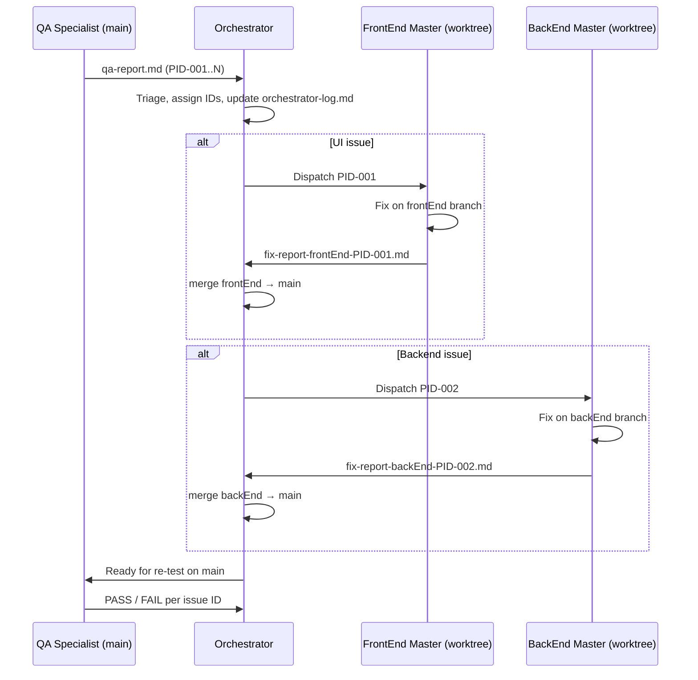

# PIDToolBox — Multi-Agent Team Workflow

This document defines how the four-agent team operates: roles, workspaces, communication protocols, branch strategy, and the end-to-end issue lifecycle.

**All agents use model:** `composer-2.5-fast`

---

## Team overview

| Agent | Prompt file | Workspace | Branch | Primary responsibility |
|-------|-------------|-----------|--------|------------------------|
| **Orchestrator** | [agent-orchestrator.md](agent-orchestrator.md) | `/home/valentin/Projects/PIDToolBox` | `main` | Triage, dispatch, merge, coordinate |
| **FrontEnd Master** | [agent-frontend-master.md](agent-frontend-master.md) | `/home/valentin/Projects/PIDToolBox-worktree/frontEnd` | `frontEnd` | React/TS/Tailwind/Plotly UI |
| **BackEnd Master** | [agent-backend-master.md](agent-backend-master.md) | `/home/valentin/Projects/PIDToolBox-worktree/backEnd` | `backEnd` | Python/FastAPI/algorithms |
| **QA Specialist** | [agent-qa-specialist.md](agent-qa-specialist.md) | `/home/valentin/Projects/PIDToolBox` | `main` | Test UI on `main`, report issues |

---

## Core principles

1. **QA tests only `main`.** Specialists work on private branches in isolated git worktrees. QA never validates specialist branches directly.
2. **Orchestrator owns merges.** Specialists fix and report; only the Orchestrator merges specialist branches into `main`.
3. **Single source of truth for defects.** All issues flow through structured reports in `.cursor/team/`.
4. **Minimal scope fixes.** Each specialist stays within their domain; cross-domain issues are split into linked IDs.
5. **Evidence before claims.** Every agent runs verification commands before reporting completion.
6. **`Refs/` is read-only** for all agents unless the user explicitly requests changes.

---

## Workspace layout

```
/home/valentin/Projects/PIDToolBox/              ← main repo (QA + Orchestrator)
/home/valentin/Projects/PIDToolBox-worktree/
├── frontEnd/                                     ← FrontEnd Master worktree
└── backEnd/                                      ← BackEnd Master worktree
```

Verify worktrees:

```bash
git -C /home/valentin/Projects/PIDToolBox worktree list
```

Expected output includes branches `main`, `frontEnd`, and `backEnd`.

---

## Communication channel

All inter-agent communication uses files under `.cursor/team/` in the main repo.

| File pattern | Author | Purpose |
|--------------|--------|---------|
| `qa-report-{YYYYMMDD-HHMM}.md` | QA | New test cycle findings |
| `fix-report-frontEnd-PID-{NNN}.md` | FrontEnd Master | Fix completion for one issue |
| `fix-report-backEnd-PID-{NNN}.md` | BackEnd Master | Fix completion for one issue |
| `orchestrator-log.md` | Orchestrator | Append-only issue tracker and dispatch log |

Create `.cursor/team/` if it does not exist. The Orchestrator maintains `orchestrator-log.md`.

---

## Issue ID convention

- Format: `PID-{NNN}` (zero-padded three digits: `PID-001`, `PID-042`)
- Linked cross-domain issues: `PID-{NNN}-FE` and `PID-{NNN}-BE`
- Orchestrator assigns IDs sequentially from `orchestrator-log.md`

### Priority levels

| Level | Meaning | Examples |
|-------|---------|----------|
| **P0** | Blocker | App crash, cannot upload logs, API 500 on core flow |
| **P1** | Wrong results | Incorrect spectrum, step response, or stats values |
| **P2** | UI parity | Layout differs from `Refs/ScreenShotsShort/` |
| **P3** | Polish | Minor styling, missing save-figure button |

### Issue status lifecycle

```
OPEN → DISPATCHED → FIX_READY → MERGED → QA_PASSED
                              ↘         ↘ QA_FAILED → DISPATCHED (re-open)
```

---

## Classification rules (Orchestrator)

Route issues to the correct specialist:

| Symptom | Owner |
|---------|-------|
| Wrong numerical output / algorithm | **backEnd** |
| API 4xx/5xx, parser/decode failure | **backEnd** |
| Layout, theme, colors, routing, client state | **frontEnd** |
| API correct in `/docs` but UI displays wrong | **frontEnd** |
| API returns wrong data, UI renders faithfully | **backEnd** |
| Shared contract change needed | Split: **backEnd** first, then **frontEnd** |

When ambiguous, verify the API response at `http://localhost:8000/docs` before dispatching.

---

## End-to-end workflow

### Phase 1 — QA test cycle

1. QA checks out latest `main` in the main repo.
2. QA runs `./start.sh` (backend `:8000`, frontend `:5173`).
3. QA executes the full test matrix (see [agent-qa-specialist.md](agent-qa-specialist.md)).
4. QA writes `qa-report-{timestamp}.md` with one section per issue.
5. QA notifies Orchestrator: report path + issue count.

### Phase 2 — Orchestrator triage

1. Orchestrator reads the QA report.
2. For each issue: assign `PID-{NNN}`, priority, owner, acceptance criteria.
3. Orchestrator appends entries to `orchestrator-log.md`.
4. Orchestrator dispatches issues to FrontEnd and/or BackEnd Master using the dispatch template (below).

### Phase 3 — Specialist fix

1. Specialist works **only** in their worktree on their branch.
2. Specialist syncs with `main` when instructed:
   ```bash
   git fetch origin && git merge origin/main
   ```
3. Specialist reproduces, fixes, verifies:
   - FrontEnd: `npm test && npm run build`
   - BackEnd: `pytest -v`
4. Specialist commits with issue ID in message: `fix(frontend): PID-NNN — description`
5. Specialist writes `fix-report-{role}-PID-{NNN}.md`.
6. Specialist notifies Orchestrator. **Does not merge to `main`.**

### Phase 4 — Orchestrator merge to main

1. Orchestrator verifies fix report and commit exists on specialist branch.
2. Orchestrator runs pre-merge checks in the worktree.
3. In main repo:
   ```bash
   git checkout main
   git pull origin main
   git merge frontEnd   # or backEnd — one branch at a time when possible
   ```
4. Orchestrator resolves merge conflicts (prefer specialist's domain changes).
5. Orchestrator verifies on `main`:
   ```bash
   cd backend && source .venv/bin/activate && pytest -v
   cd frontend && npm test && npm run build
   ```
6. Orchestrator syncs specialist worktrees after merge:
   ```bash
   git -C /home/valentin/Projects/PIDToolBox-worktree/frontEnd fetch origin
   git -C /home/valentin/Projects/PIDToolBox-worktree/frontEnd merge origin/main
   git -C /home/valentin/Projects/PIDToolBox-worktree/backEnd fetch origin
   git -C /home/valentin/Projects/PIDToolBox-worktree/backEnd merge origin/main
   ```
7. Orchestrator updates issue status to `MERGED` and notifies QA.

### Phase 5 — QA re-test

1. QA pulls latest `main`.
2. QA runs acceptance criteria from the original issue + fix report.
3. QA marks each issue `QA_PASSED` or `QA_FAILED` in a new report section or follow-up report.
4. If `QA_FAILED`, Orchestrator re-dispatches to the same or different specialist.

---

## Sequence diagram



---

## Dispatch template (Orchestrator → Specialist)

```markdown
**Dispatch to {FrontEnd Master | BackEnd Master}**

- **Issue ID:** PID-NNN
- **Priority:** P0 | P1 | P2 | P3
- **Summary:** one-line description
- **Steps to reproduce:** (from QA report)
- **Expected vs actual:** (from QA report)
- **Suspected area:** file paths if known
- **Acceptance criteria:** checklist QA will run after merge
```

---

## Port and server coordination

Only one full dev stack should run on default ports at a time:

| Service | Port |
|---------|------|
| FastAPI backend | 8000 |
| Vite frontend | 5173 |

- **QA** uses `./start.sh` on `main` during test cycles.
- **Specialists** coordinate with Orchestrator to avoid port conflicts when running `./start.sh` in worktrees.
- Use `./kill.sh` from the main repo to stop servers before another agent starts.

---

## Shared project conventions

All agents must read before working:

1. [README.md](../../README.md) — architecture, API, pages, known gaps
2. [UPDATES.md](../../UPDATES.md) — mandatory changelog (read before changes, update after merges)
3. [pidtoolbox_react_clone_f16620bf.plan.md](../../Docs/pidtoolbox_react_clone_f16620bf.plan.md) — original implementation intent

### Version and changelog rules

After code merges to `main`, update `UPDATES.md`:

- Newest entry at the top
- Format: `X.Y.Z` — increment Z for fixes, Y for features, X for breaking changes
- Bump version in `backend/pidbox/main.py` and `backend/pidbox/__init__.py` when releasing

Typically the Orchestrator or the merging agent handles `UPDATES.md` after a successful merge.

### Git rules

- **No commits without explicit user permission** unless the user has authorized autonomous operation.
- Specialists never push directly to `main`.
- Specialists never ask QA to test their private branches.
- Prefer merge commits over rebase for audit trail when integrating specialist branches.

---

## orchestrator-log.md format

```markdown
# Orchestrator Log

## Issue tracker

| ID | Priority | Owner | Status | Summary | QA Report | Fix Report |
|----|----------|-------|--------|---------|-----------|------------|
| PID-001 | P1 | frontEnd | MERGED | Theme contrast on spectral page | qa-report-20260524-1430.md | fix-report-frontEnd-PID-001.md |

## Session log (append below)

### 2026-05-24 14:30
- Received QA report with 3 issues
- Dispatched PID-001 to FrontEnd Master
- ...
```

---

## Escalation paths

| Situation | Action |
|-----------|--------|
| FrontEnd finds API returns wrong data | Escalate to Orchestrator → dispatch to BackEnd |
| BackEnd needs UI change to test | Escalate to Orchestrator → dispatch to FrontEnd |
| Merge conflict spans both domains | Orchestrator assigns primary owner; secondary reviews |
| QA blocked (install fails, no test data) | Report P0 blocker to Orchestrator |
| Issue unclear after re-test | QA adds evidence; Orchestrator re-classifies |

---

## Quick reference: who does what

| Action | QA | FrontEnd | BackEnd | Orchestrator |
|--------|:--:|:--------:|:-------:|:------------:|
| Test on `main` | ✓ | | | |
| Fix code | | ✓ (UI) | ✓ (API/algo) | |
| Merge to `main` | | | | ✓ |
| Write qa-report | ✓ | | | |
| Write fix-report | | ✓ | ✓ | |
| Dispatch issues | | | | ✓ |
| Update UPDATES.md | | | | ✓ (post-merge) |
| Modify `Refs/` | | | | ✗ (all) |
